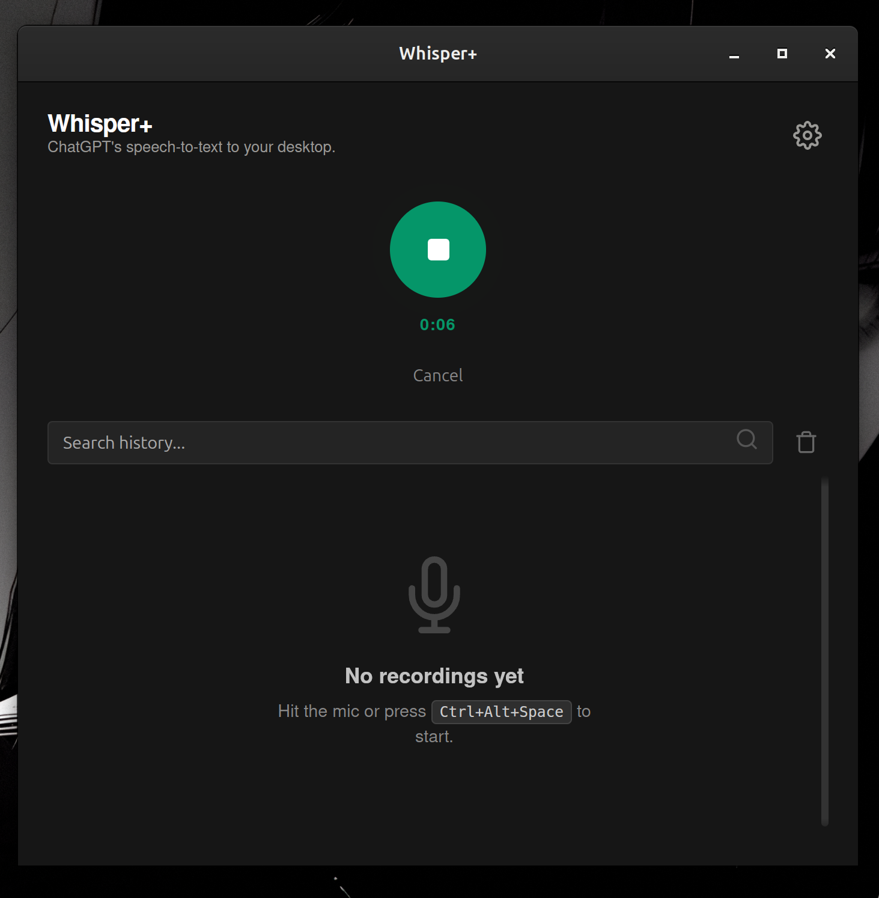

# Whisper+

   

A lightweight cross-platform application that brings OpenAI Whisper's voice-to-text capabilities to your desktop.



## Table of Contents

- [Features](#features)
- [Transcription Methods](#transcription-methods)
    - [Option 1: Local Whisper (Recommended)](#option-1-local-whisper-recommended)
    - [Option 2: Cloud (ChatGPT)](#option-2-cloud-chatgpt)
- [Installation](#installation)
- [Configuration](#configuration)
    - [Custom Shortcuts](#custom-shortcuts)
    - [Wayland Users (Linux)](#wayland-users-linux)
- [Development](#development)

---

## Features

-   **Dual Engine Support**: Choose between **Local Whisper** (Privacy/Offline) or **Cloud ChatGPT** (High Accuracy).
-   **GPU Acceleration**: Native support for **NVIDIA (CUDA)** and **AMD/Cross-platform (Vulkan)** for blazing fast local inference.
-   **Smart Hardware Detection**: Automatically detects your CPU/GPU capabilities and RAM to suggest optimal settings.
-   **Global Shortcuts**: Toggle recording from anywhere. Fully customizable on X11/Windows/macOS.
-   **Auto-Paste & Copy**: Automatically types text into your active window or copies to clipboard.
-   **History with Stats**: View past recordings with detailed metadata (Backend used, processing time).
-   **Multilingual Translation**: Seamlessly translate foreign speech into English text using the "Translate to English" toggle.
-   **System Tray**: Runs silently in the background.

---

## Transcription Methods

Whisper+ offers two distinct ways to transcribe your audio. You can switch between them instantly in Settings.

### Option 1: Local Whisper (Recommended)

This method runs the AI model **entirely on your device**.

-   **Privacy**: Your audio never leaves your computer.
-   **Offline**: Works without an internet connection.
-   **Fast**: Fast on GPUs (often near real-time).
-   **Cost**: Free (no OpenAI account required).

**Requirements:**
-   **No Python/PyTorch needed**: The engine is self-contained.
-   **Linux**: Requires `libasound2` (installed by default on most distros). Specialized GPU drivers (Nvidia/AMDGPU) are needed only if you want GPU acceleration.
-   **macOS**: No special requirements.
-   **Windows**: No special requirements.

**How it works:**
The app handles everything for you. It downloads the optimized Whisper models files (GGUF format) and runs them using `whisper.cpp` bindings.

**Translation Mode:**
When using Local Whisper, you can enable **"Translate to English"** in settings. This allows you to speak in any supported language (Japanese, French, Spanish, etc.) and receive perfectly translated English text instantly. We've implemented custom filtering to eliminate common "ghost" translations like *(Speaking in foreign language)*.

**Performance & Hardware:**
-   **GPU Users**: The app automatically detects NVIDIA or AMD GPUs and enables acceleration.
-   **CPU Users**: Works fine on modern CPUs! Just stick to "Tiny" or "Base" models for speed.
-   **Model Selection**:
    -   `Tiny` (~75MB): Fastest, good for simple commands.
    -   `Base` (~142MB): Balanced.
    -   `Medium` (~1.5GB): High accuracy. **Recommended max** unless you have 16GB+ RAM.
    -   `Large` (~3GB): Best accuracy, but slow on CPU.

> [!TIP]
> **Privacy Note**: This is the most secure method. It is completely offline, everything happens locally on your device.

### Option 2: Cloud (ChatGPT)

This method acts as a bridge to your personal ChatGPT account.

-   **Accuracy**: Uses OpenAI's powerful cloud models.
-   **Context**: Can be smarter with context (sometimes).
-   **Requirements**: Requires a text-capable internet connection and a valid session token.

> [!IMPORTANT]
> **Security Warning**: This requires your private ChatGPT Session Token. This token gives full access to your account.
> -   **Whisper+ stores this token LOCALLY**.
> -   It is **only** used to communicate directly with `chatgpt.com`.
> -   **NEVER share this token with anyone else.**

#### Retrieving your Token

1.  Log in to [chatgpt.com](https://chatgpt.com).
2.  Open Developer Tools (`F12`).
3.  Go to **Application** tab > **Cookies** > `https://chatgpt.com`.
4.  Copy the value of `__Secure-next-auth.session-token`.
5.  Paste it into Whisper+ Settings.

---

## Installation

### Quick Install (Linux & macOS)

```bash
curl -fsSL https://raw.githubusercontent.com/supSugam/whisper-desktop/main/install.sh | bash
```

### Manual Installation
Download the latest installer from [Releases](https://github.com/supSugam/whisper-plus/releases/tag/v1.0.3):
-   **Windows**: `.exe`
-   **Linux**: `.AppImage`, `.deb`
-   **macOS**: `.dmg`

---

## Configuration

### Custom Shortcuts
-   **Windows/macOS/X11**: Go to Settings > Shortcut. Click the **Record** button and press your desired combination (e.g., `Ctrl+Shift+L`).
-   **Wayland**: See below.

### Wayland Users (Linux)
Global shortcuts on Wayland are restricted by security protocols.
1.  Go to **System Settings > Keyboard > Shortcuts**.
2.  Create a **Custom Shortcut**.
3.  **Command**: `whisper-plus --toggle` (or path to your AppImage).
4.  **Shortcut**: Set your desired keys.

> [!NOTE]
> Auto-paste on Wayland only works with "some" XWayland apps (e.g. VSCode, Discord). Native Wayland apps may not receive the text automatically.

---

## Development

To build the application from source:

### Prerequisites

-   **Node.js**: [Download](https://nodejs.org/) (v16+)
-   **Rust**: [Install](https://www.rust-lang.org/tools/install)
-   **Linux Dependencies** (Ubuntu/Debian):
    ```bash
    # Core Libraries (GUI, System Tray)
    sudo apt-get install libwebkit2gtk-4.1-dev \
        build-essential \
        curl \
        wget \
        file \
        libssl-dev \
        libgtk-3-dev \
        libayatana-appindicator3-dev \
        librsvg2-dev

    # Audio Dependencies (Required for recording)
    sudo apt-get install libasound2-dev

    # GPU Dependencies (Vulkan - Recommended for AMD/Intel/Nvidia)
    sudo apt-get install libvulkan1 mesa-vulkan-drivers vulkan-tools libvulkan-dev
    
    # Optional: CUDA (NVIDIA only)
    # sudo apt-get install nvidia-cuda-toolkit
    ```

### Build Instructions

1.  Clone & Install:
    ```bash
    git clone https://github.com/supSugam/whisper-plus.git
    cd whisper-plus
    npm install
    ```

2.  **Dev Mode (Default with Vulkan)**:
    ```bash
    npm run tauri dev
    ```
    *Note: Vulkan support is enabled by default for broad GPU compatibility.*

3.  **Specific Backends**:
    If you want to force specific backends, use feature flags:
    ```bash
    # NVIDIA (CUDA) - Requires CUDA Toolkit installed
    npm run tauri dev -- --features cuda

    # AMD (ROCm) - Requires ROCm installed
    npm run tauri dev -- --features rocm
    ```

4.  **Build Release**:
    ```bash
    npm run tauri build
    ```

## License
MIT License.